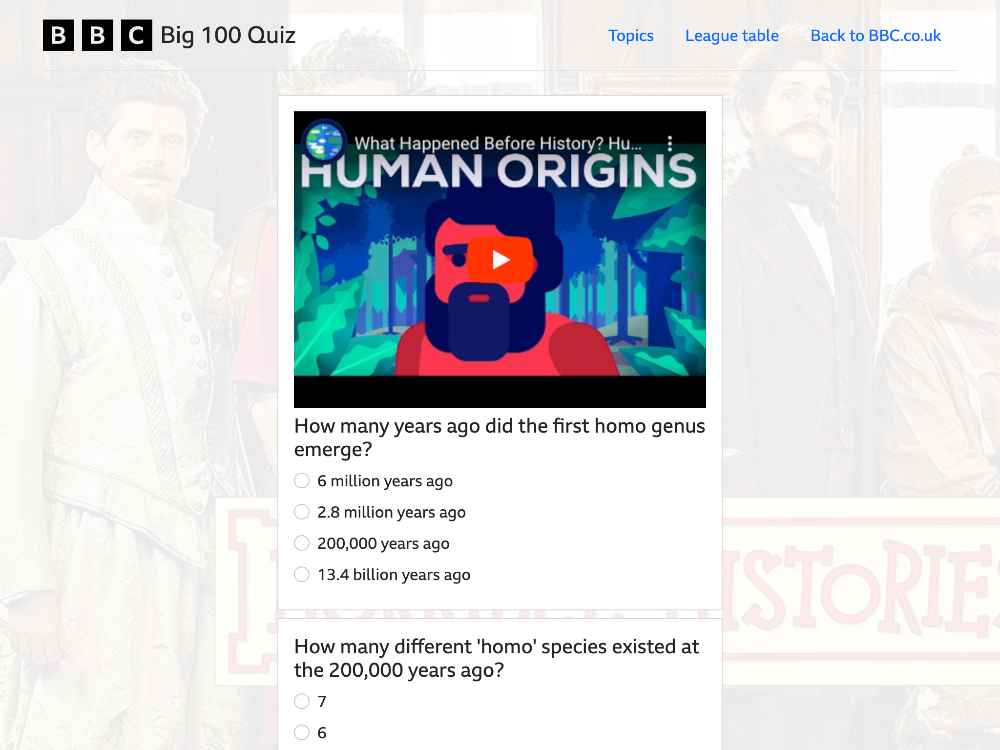

# BBC Big 100 Quiz
This is our quiz website project by James, Jakub and Callum.

## Features
* View and visit a range of topics from the topics page, complete with topic images, titles, descriptions and quiz types
* Complete quiz questions and get feedback once submitted
* Multiple quiz question types (such as multiple choice and video)
* Add your score to a league table along with your nickname
* View and export metrics that are recorded on quiz loads and completions (quiz topic, difficulty, timestamp, question count, formats)
* GDPR compliant
* Mobile friendly
* Accessible (100% on Lighthouse) and works for screen readers and switch control/keyboard navigation
* Tested with integration tests

Achieved Version 5

## Screenshots
Topics page:

Quiz page:

